# grocery_list_app

A simple grocery list app. It allows you to manage groups and have diferent grocery lists. (Family, friends, X's Birthday party, etc.)
It also allow you to add new products, organized by category.

## why?
- I really need this app in my family.
- I wanted to learn how to **login with your phone number** in Firebase.
- Keep improving and learning with Flutter and Firestore.

## functionality
- [x] Manage groups
- [x] Manage lists
- [x] Add products to lists
- [x] Create new products
- [x] Manage profile (username and picture)
- [x] Everything is **reactive**
- [ ] Notifications

## disclaimer
This project was created to learn about flutter in general. 
- Code is heavily coupled.
- There are no tests.
- There is no clear architecture.
- Code is not optimized and wrote similary in differents places.
- Next project will be implemented with <a href="https://www.youtube.com/watch?v=KjE2IDphA_U&list=PLB6lc7nQ1n4iYGE_khpXRdJkJEp9WOech">ResoCoder Clean Architecture</a> in mind.
## how? a million of screenshots

1. Login using your phone number
2. Sms Code

You can sign in with your phone, after entering your number, you'll receive a sms code.

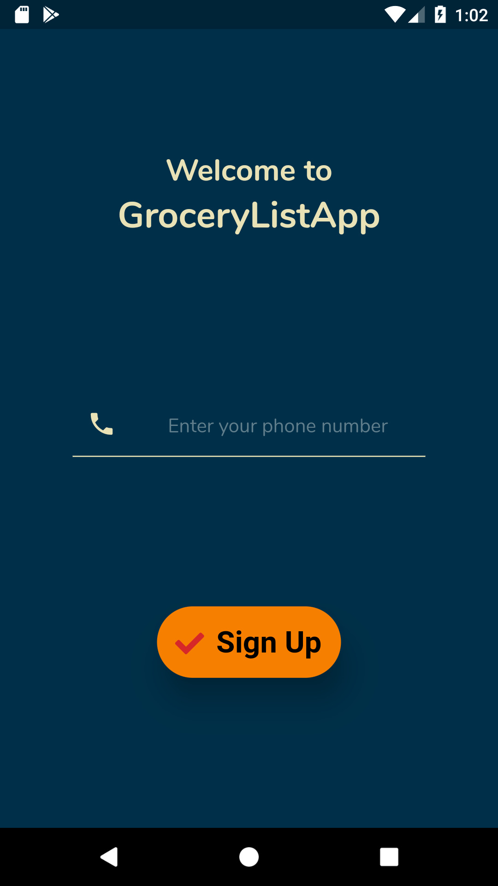
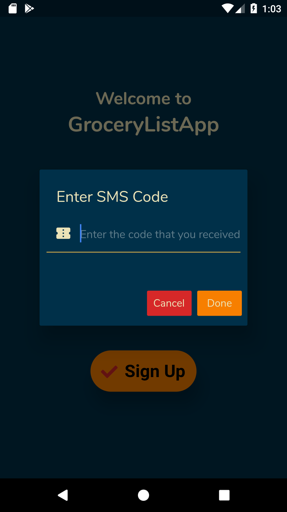

3. Homepage

In the homepage you'll see all your lists.

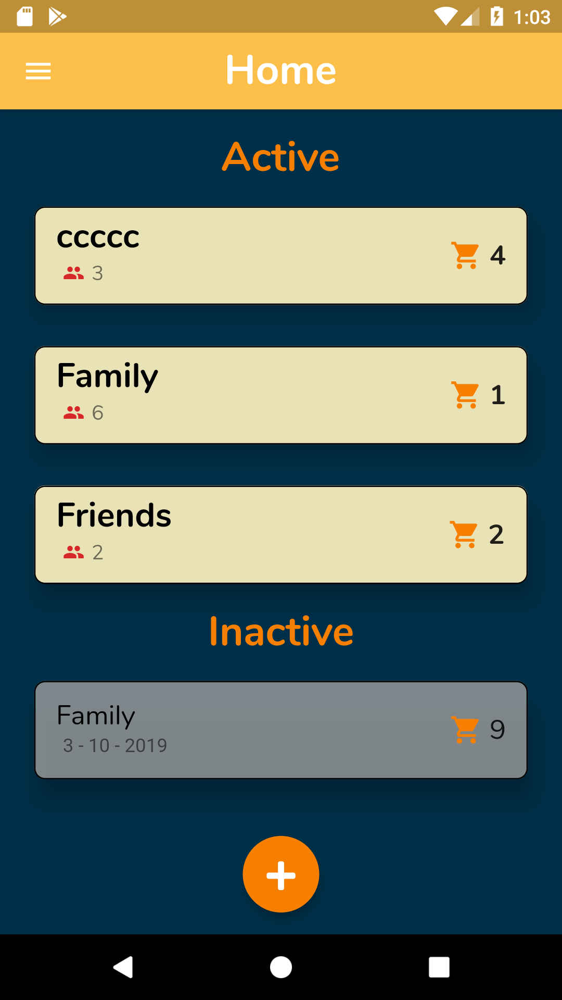

4. Grocery List
5. Grocery List Options

You can check the items, add new ones, add ppl to groups and finish the list, which means that you went to the shop. A new empty list (same group) will appears.

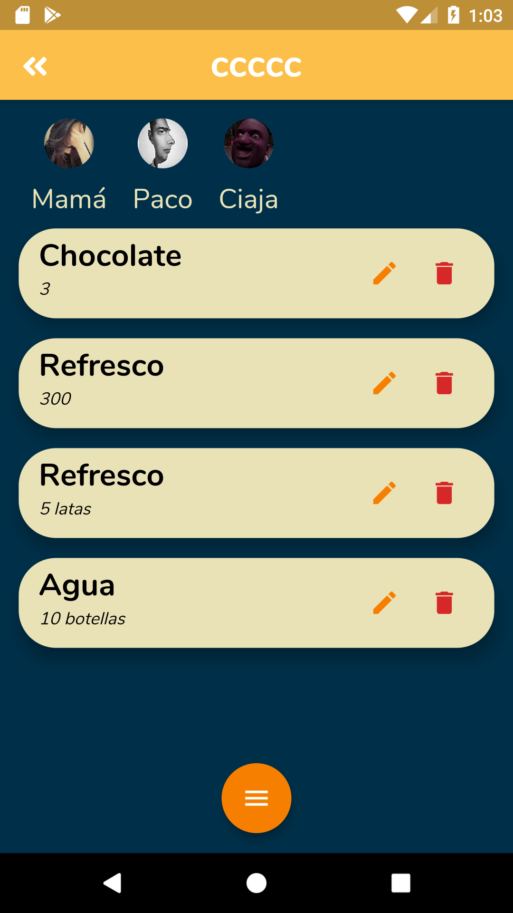
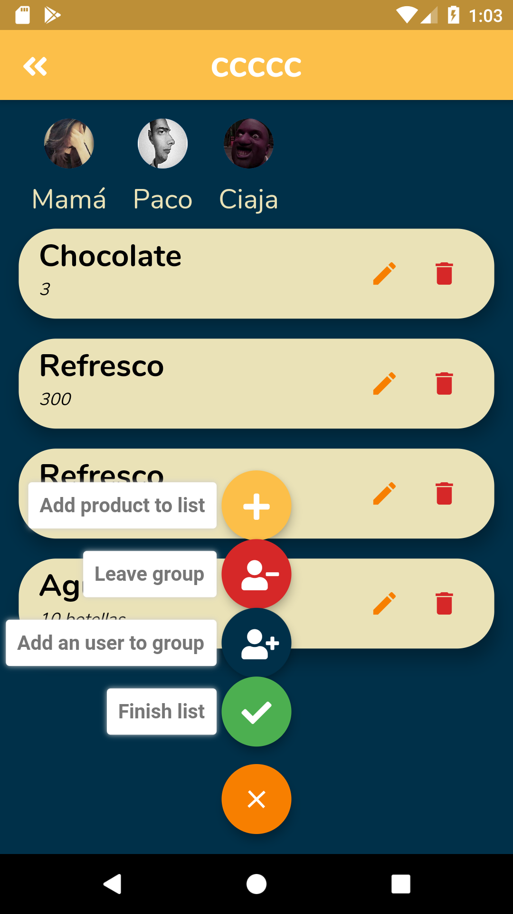

6. Add product to list
7. Add a magnitude to that product

When you add a product to a list, you can quickly add one created by you or seach if exist. Then, you need to add a magnitude to that item. "Water: 3 bottles"

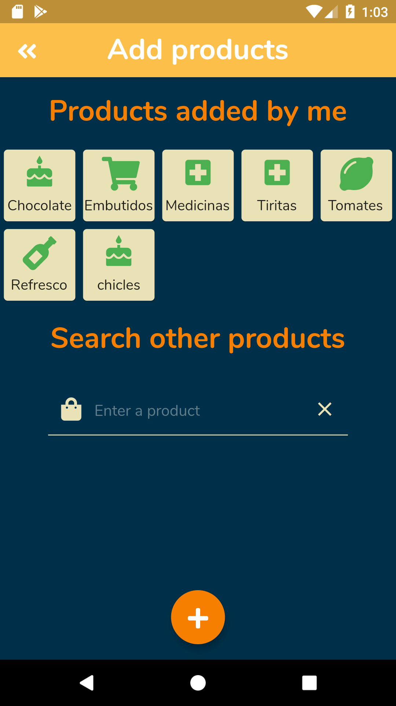
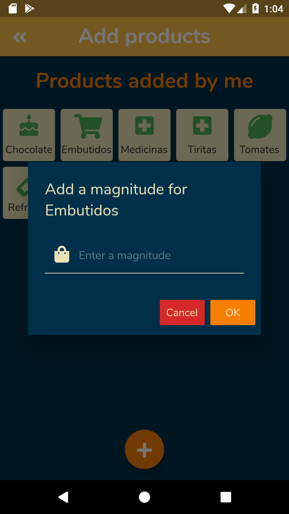

8. Create new product

You can add new products to the app collection, choosing also a category.

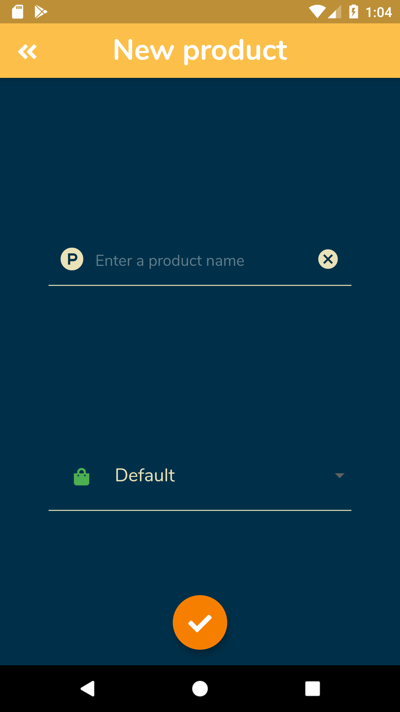

9. Drawer

In the drawer you can edit yor profile info, create new products or create a new group.

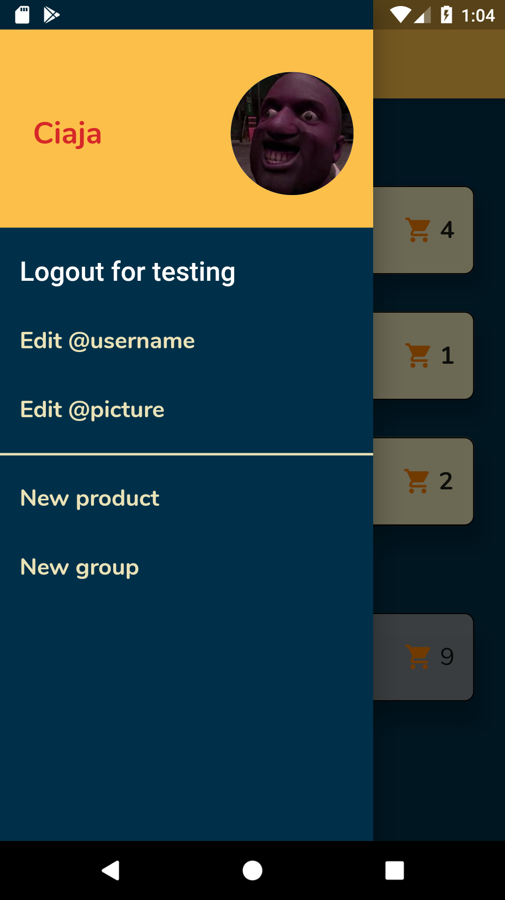

10. New Group

While creating a group, you can search by username or by phonenumber

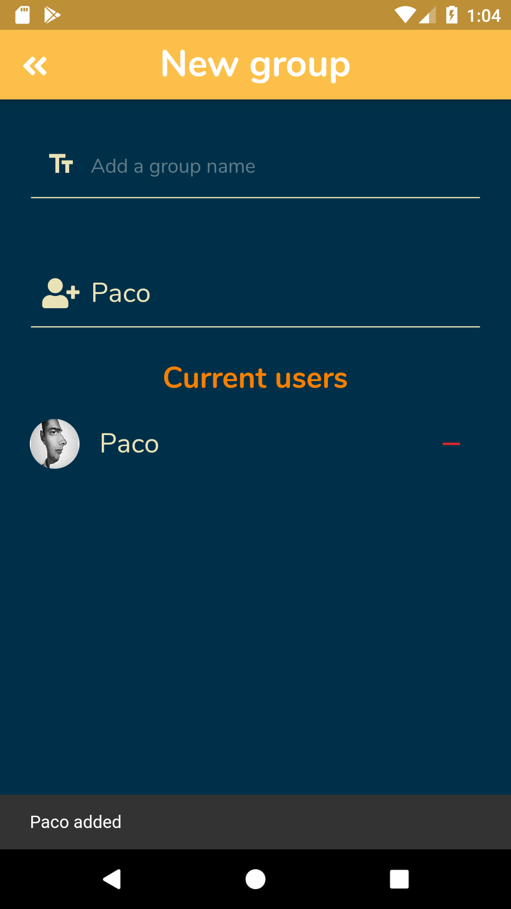

11. Edit username
12. Edit picture

You can easily change your username or your picture. It will be stored in firestore.

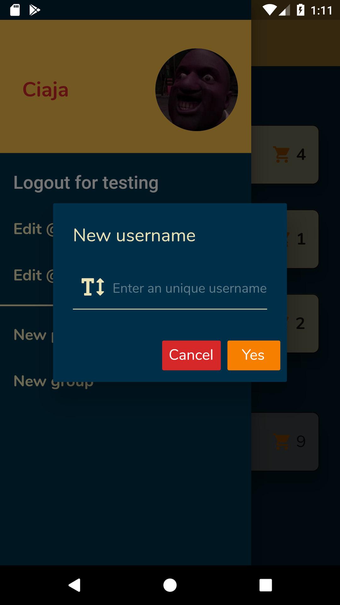
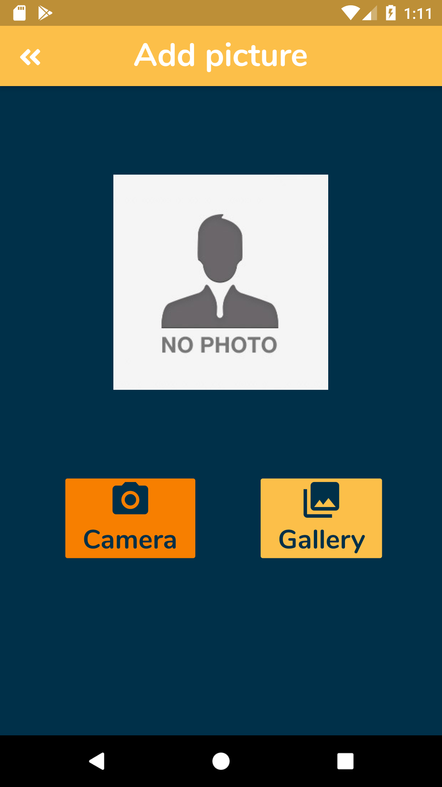

## technology used
- Firestore and Flutter
### packages - https://pub.dev/
- cloud_firestore
- provider
- font_awesome_flutter
- json_annotation
- firebase_auth
- unicorndial
- firebase_storage
- image_picker
- sleek_circular_slider

## What's next?
The next feature that I would like to implement would be notifications. (Somebody added 4 water bottles to Family list)

